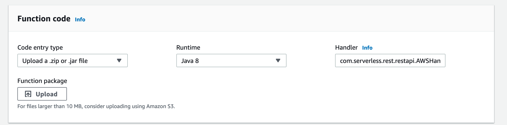
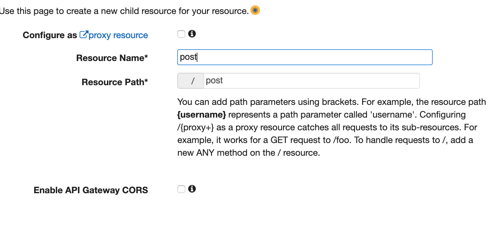
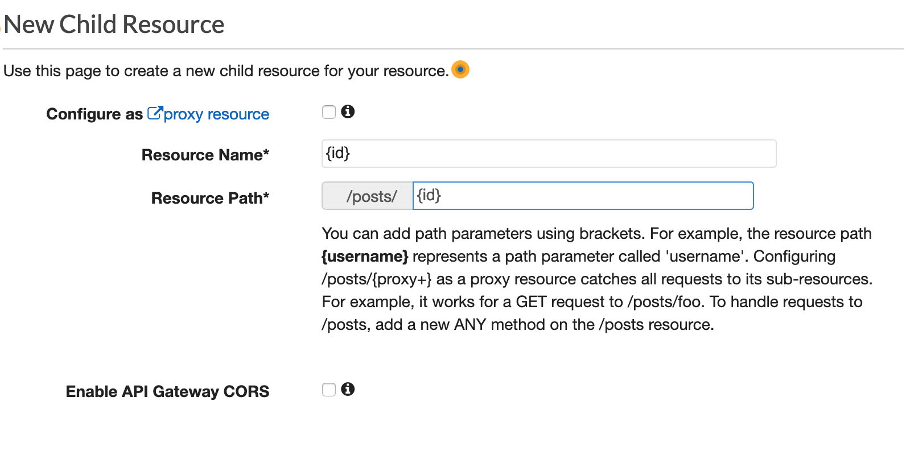
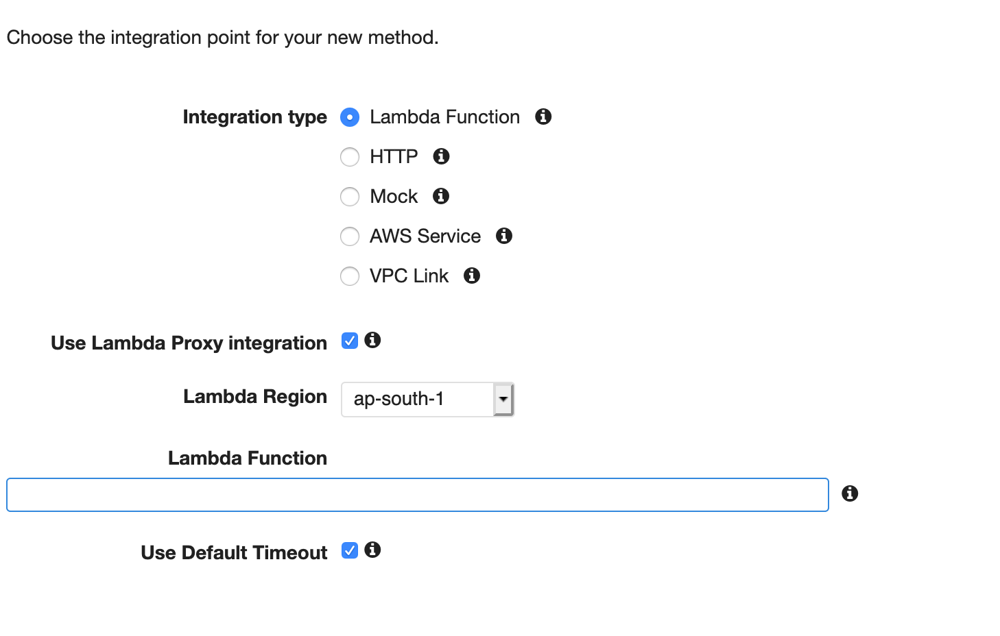
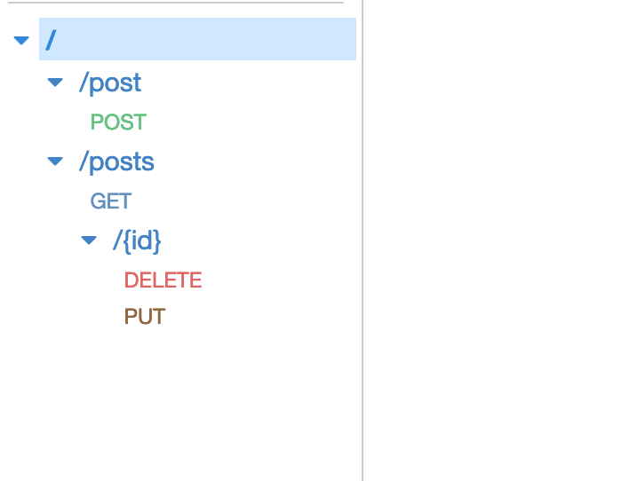
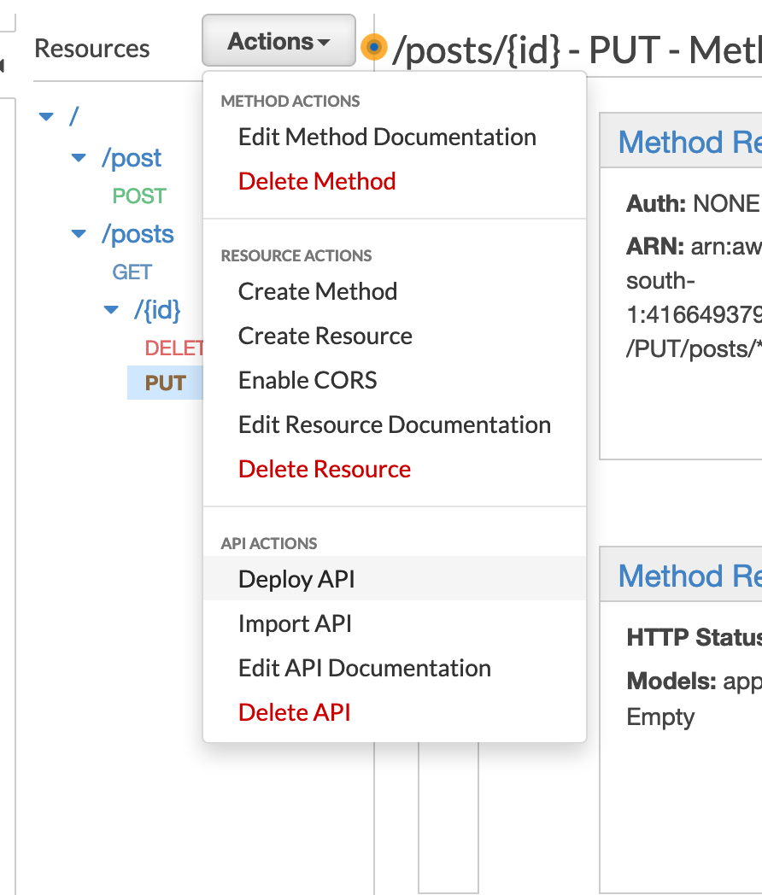

# SpringBoot_MariaDB_AWSLAmbda
Demo for SpringBoot + Maria DB + AWSLambda
# Purpose

 1. Quick Starter Project for those who like to see how Maven + Spring Boot + Maria DB + AWS Lambda + API Gateway works
 2. As a whole, its a way to try Serverless Architecture using Java

# Pr-requisites

 1. Java 8 and Maven
 2. Maria DB Server and a client
 3. AWS Account
 
 # Steps
 1. Clone the Repo
 5. Use IDE like VSCode or Eclipse. If VSCode, open the workspace file
 6. Study the code🤷‍♂️
 7. Open Application.properties. Configure Maria DB URL, Username and Password. You can spin up a free tier RDS in AWS itself.
 8. Make a maven build using `mvn package` from command line/terminal. JAR file will be created
 9. Open AWS Lambda. Create a function and once created provide the handler name as `com.serverless.rest.restapi.handler.AWSHandler::handleRequest` as shown below. Upload JAR file here.
 
 10. Do not configure API Gateway from AWS Lambda. Instead Go to API Gateway in AWS. Create a new API. 
 11. You have to create 2 resource and 1 child resource. `/post` , `/posts` and `{id}` as sub child for `posts` . Note the difference between post and posts
 
 
 12. Now create methods for these resources POST for `/post`, GET for `posts`, PUT and DELETE for `{id}` child resource. Configure as shown below. Enter the lambda which you created in function name to link.
 
 13. Finally it should look something like this
 
 14. Deploy API like this. Select any stage name.
 
 15. Get the API gateway URL and test using Postman or curl
 

## Note

 1. This is more like a quick POC. So its not the best way to write code.
 2. Add tests in real world.

## If it helped you
 :beers: Write me a quick and simple recommendation for me in [linkedin](https://in.linkedin.com/in/dhilipr)
